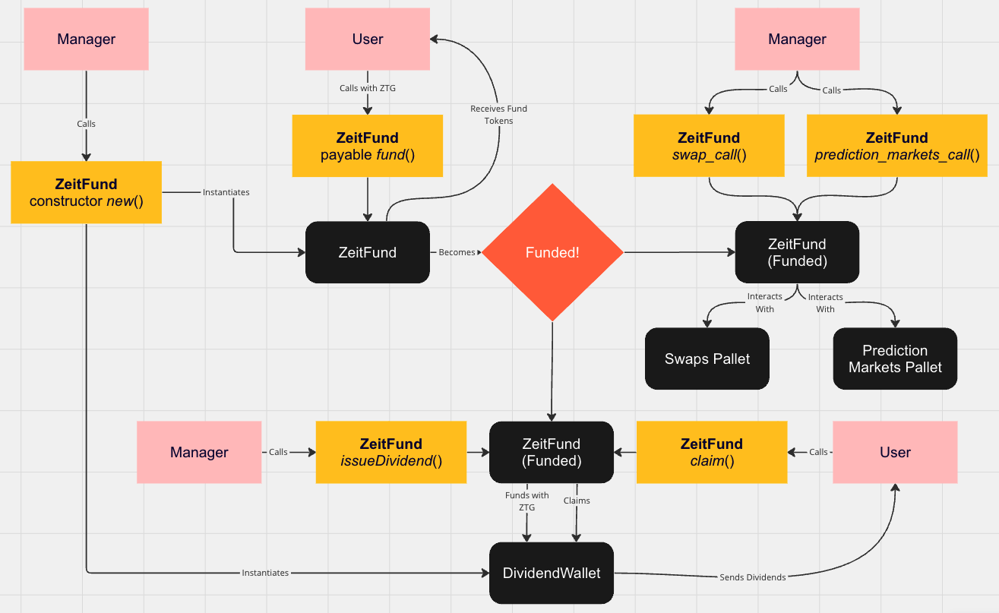

# Zeitgeist Fund

This repository is a simple fund that allows a single manager to compose a single ERC-like asset of multiple prediction markets.  

**It is not audited, and was built in a relatively small amount of time. Do not use in production yet.**

## Project
The entire repository is a Rust workspace. Compile by navigating to a folder and executing `cargo contract build --release`. The output will be within the main folder, in the `target` folder.  

### dividend_wallet
This is a smart contract that holds ZTG dividends so that it is separate from the manager's available liquidity. It can only be distributed with a smart contract call from the Zeitgeist fund when a user wants to claim their dividend.  

This smart contract is automatically instantiated by the Zeitgeist Fund.  

### zeit_fund
This is the main smart contract. It is created by a manager.  

**Workflow:**
1. Manager creates the ZeitFund with an initial funding goal.
2. Users add ZTG with `fund()` until the fund is complete, unlocking it for the manager.
    - It is recommended that managers also fund, to lock their tokens as a trust mechanism. Otherwise, there is nothing stopping the manager from dumping. By locking, their liquidity is locked until liquidation of the fund.
3. Manager can interact with markets & issue dividends of ZTG.
    - Users can claim ZTG dividends as issued by the Manager with `claim()`.

## Interact:

https://contracts-ui.substrate.io/instantiate?rpc=wss://bsr.zeitgeist.pm